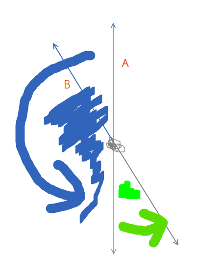

## 2019牛客多校第八场 F题 Flowers
先枚举出三角形内部的点D。
下面所说的旋转没有指明逆时针还是顺时针则是指逆时针旋转。
### 固定内部点的答案的获取
$anti(A)$或者说$\overline{A}$表示$\overrightarrow{DA}$旋转180°之后的方向。
$block(A,B)$表示的是$\overrightarrow{DA}$旋转到$\overrightarrow{DB}$的扫过的几何区间。小括号表示不包含边界，中括号表示包含边界。
假设确定了A点，那么对于D,A的ans数是
$$\sum\limits_{B \in (A,\overline{A})}\sum\limits_{C \in (\overline{A}, \overline{B})}1$$.
以下是示意图。对于一个确定的A，B在蓝色区间范围内取一个点。
之后对于确定的B，C只需要且只能在绿色区间范围选一个。

如何确定几何区间里点的个数呢？
我们可以先求出一下信息保存在数组中。
1. 各个点按逆时针方向编号
2. 各个点的方向`dir`数组
3. 各个方向第一个点的编号和最后一个点的编号，即$first$和$last$.`infos`数组
4. 各个方向的反向方向的$first$和$last$.`antiinfos`数组.

假设我们都已经求出来了。
$$\sum\limits_{B \in (A,\overline{A})}\sum\limits_{C \in (\overline{A}, \overline{B})}1\\
=\sum\limits_{B \in (A,\overline{A})}antiinfos[dir[B]].first - antiinfos[dir[A]].last - 1$$
而$B \in (A,\overline{A})$换成点的编号表示的话就是——
$ infos[dir[A]].last + 1 \leq B < antiinfos[dir[A]].first\;$
**注意现在的求和式中对于一个固定的A来说，有关A的都是常量。所以这是一个只和变量B有关的式子。**
**所以可以看做对一个数组$a[B]$求区间和的式子。**
即变成$\sum\limits_{B = infos[dir[A]].last + 1}^{antiinfos[dir[A]].first - 1} a[B]$.
对于一个固定的A求出每一个a[B]只能对一个个B单独求.
但$A$换成下一个方向的$A'$时。B的上界和下界将会随之改变，但是新的上界和下界，很有可能会有一大段重复的。即假设旧的区间是[l,r],新的区间是[L,R]。对于这两个区间重叠的部分$B \in [u,v]$.对于a[B]来讲，B没有变化，变化的只是A变成了A'。所以$[u,v]$区间里的$a[B]$只需要在集体区间减去一个与$A,A'$有关的变化量即可。而对于[L,R]区间中不重叠的部分，就只能一个一个B单独枚举计算了。由于A是从逆时针方向一个个往后枚举的，所以上下界[l,r]也是一直往后移动。因此，不重叠的需要单独计算的部分a[B]最多就是每个点计算一次。**对于所有的A来说，单独计算修改次数是$O(n)$级别的。求区间和的次数也是$O(n)$级别的。**
因此可以使用线段树解决。
#### 注意
对于一朵Flower ABC-D，D是内部点，在这个方法下，会被计算三次。分别是A，B，C充当上面所说的A点。所以最后答案要除以3.

### 反向信息的求取
对于旋转180°之后的方向，即反方向。如果这个方向上有点，那么就取这个方向的$first$和$last$;如果这个方向上没有点，那么$first$置为旋转度数超过180°的第一个方向的$first$,而$last$就是$first-1$。  

对于单个方向$\overrightarrow{DP}$的反方向的$\overline{\overrightarrow{DP}}$显然可以通过$\overrightarrow{DP}$的以下一个方向开始，一个个方向检查过去，找到恰好180°或者第一个大于180°的。因此复杂度是$O(n)$

---

对于P所有方向的反方向是$O(n^2)$????? 
由于我们一个点P的方向实际上是$\overrightarrow{DP}$的方向，所以外面还有一层枚举D的$O(n)$.那样子$O(n^3)$就Tle了。

---

但是，注意到$\overrightarrow{DP}$的下一个方向$\overrightarrow{DQ}$的反向$\overline{\overrightarrow{DQ}}$，肯定不会早于$\overline{\overrightarrow{DP}}$出现。所以可以整体$O(n)$。求出所有方向的反向。

最后总的复杂度是
O(n^2lnn).
其中排序、线段树的区间查询、修改都达到了O(n^2lnn)。

###　源程序
代码中的区间l,r,L,R是左闭右开的。first和last则都是包含的。
@import "main.cpp"

### 弱鸡的我的吐槽模块
由于一开始按照逆时针编号的排序是使用atan2获取极角，然后一直卡在90.48%。各个地方都改过，还是一直过不去。写了两天了，这个程序还是推倒然后重新写的一个。
debug到怀疑人生。最后发现牛客网提交的程序里面可以有assert语句，然后，assert不成立还会re并提示是哪一行assert语句出错了。
于是疯狂assert。
通过疯狂assert最后诡异的发现更后面的anti的last居然比前面的last还要小，导致区间集体要减去的数算出来是个负数。
然后疯狂读自己的程序，妄图找出bug，分析了好久好久，分析到最后已经相当于从数学上确定，没有逻辑错误，就是正确的。
想过爆long long。但是想来想去不可能，许久之后怀疑是排序之后并不是逆时针排列的，最后把atan2换掉了之后，突然就ac了。
atan2让我浪费了一天半的时间。
**珍爱生命，慎用atan2.**
